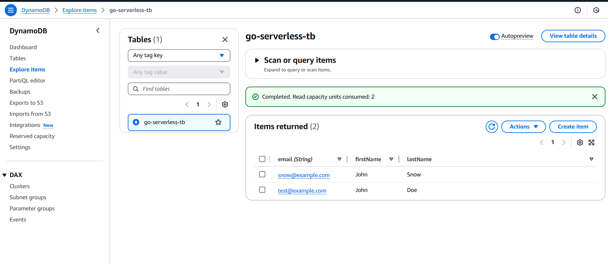
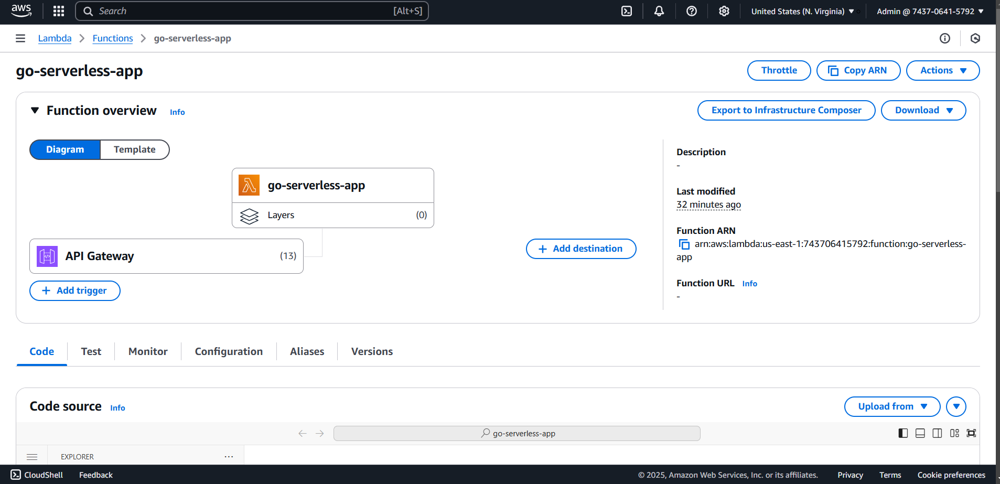
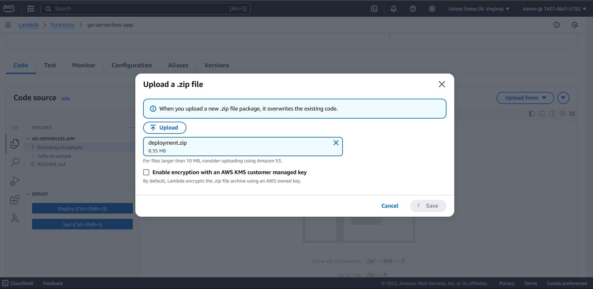
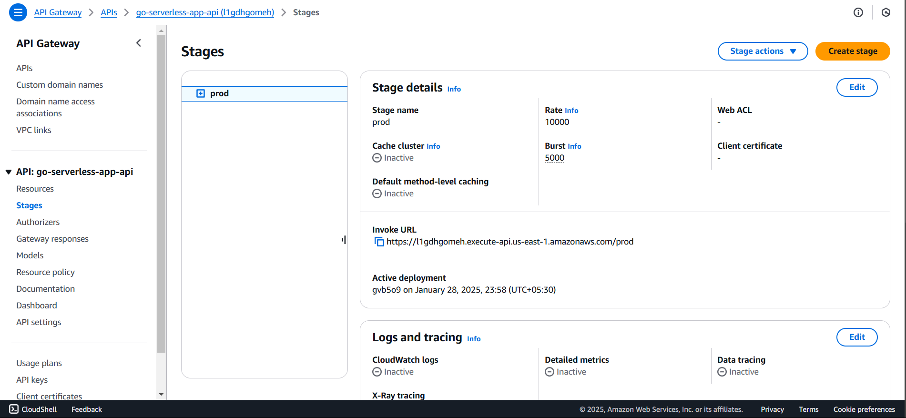

# Serverless with Golang

This serverless application (REST API) is built using **Golang** to leverage its efficiency and concurrency features, providing a highly scalable and reliable backend service. It follows the serverless architecture paradigm by utilizing **AWS Lambda** for compute, **Amazon DynamoDB** for persistent data storage, and Amazon **API Gateway** for request handling and routing.

This architecture ensures cost-effectiveness by eliminating the need for dedicated servers while maintaining scalability and high availability, making it ideal for modern cloud-native applications.

---

## Features

- **Serverless Architecture**: Powered by AWS Lambda and API Gateway.
- **Database**: DynamoDB for efficient, scalable storage.
- **Written in Go**: Leveraging Go's speed and efficiency.

---

## Prerequisites

Ensure you have the following installed:

1. **Go** (Golang):
   - Install Go from [Go Official Website](https://golang.org/dl/).

---

## Project Structure

```plaintext
Serverless-with-Golang/
├───build
|   └───deployment.zip
├───cmd
|   ├───main.go
│   └───bootstrap
├───pkg
│   ├───handlers
│   ├───user
│   └───validators
├── README.md
├── go.sum
└── go.mod
```

## Steps to Deploy the Application

1. **Clone the Repository**
   ```bash
   git clone https://github.com/ARUP-G/Serverless-with-Golang.git
   cd Serverless-with-Golang
   ```

2. **Build the Go Application**
   ```bash
   # For Linux user
   GOOS=linux GOARCH=amd64 go build -o bootstrap cmd/main.go
   #For windows user
   $env:GOOS="windows"; $env:GOARCH="amd64"; go build -o bootstarp cmd/main.go
   # This builds the Go application compatible with AWS Lambda's environment.
   ```

3. **Setup Using AWS Console**

   1. **Create a DynamoDB Table**
      - Go to the DynamoDB Console: [DynamoDB Console](https://console.aws.amazon.com/dynamodb).
      - Click **Create table**.
      - Provide the following details:
        - **Table Name**: go-serverless-tb (or a name of your choice, change it in the main.go)
        - **Partition Key**: email (String)
      - Select **On-demand capacity mode (Pay-per-request)** for flexibility.
      - Click **Create table**.
      

   2. **Create a Lambda Function**
      - Go to the Lambda Console: [Lambda Console](https://console.aws.amazon.com/lambda).
      - Click **Create function**.
      - Select **Author from scratch**.
      - Provide the following details:
        - **Function name**: go-serverless-app
        - **Runtime**: Amazon Linux 
        - **Architecture**: x86_64
      - Under **Permissions**, create a new role with basic Lambda permissions.
      - Click **Create function**.
      

   3. **Upload the Code**
      - Scroll to the **Code source** section.
      - Click **Upload from** and select **.zip file**.
      - Prepare your .zip file by building your Go application:
        ```bash
        zip deployment.zip bootstrap
        ```
      - Upload the `deployment.zip` file and click **Save**.
      

   4. **Add Environment Variables (Optional)**
      - Scroll to the **Configuration** tab and click **Environment variables**.
      - Add variables such as `TABLE_NAME` for your DynamoDB table name.

   5. **Grant Lambda Access to DynamoDB**
      - In the Lambda Console, go to the **Configuration** tab.
      - Click **Permissions** and then click the role name under **Execution role**.
      - Attach the `AmazonDynamoDBFullAccess` policy:
        - Click **Add permissions** → **Attach policies**.
        - Search for `AmazonDynamoDBFullAccess` and click **Attach policy**.

   6. **Create an API Gateway**
      - Go to the API Gateway Console: [API Gateway Console](https://console.aws.amazon.com/apigateway).
      - Click **Create API** and choose **REST API**.
      - Select **Build**.
      - Under **Configure routes**, add the following route:
        - **Method**: ANY
        - **Resource path**: /items/{proxy+}
      - Select **Integration** and choose **Lambda function**.
      - Enter your Lambda function name (go-serverless-app).
      - Click **Create**.
      - Deploy the API:
        - Click **Deployments** under your API name.
        - Select **Create** and provide a stage name (e.g., prod).
        - Click **Deploy**.
      

4. **Test the Setup**

   1. **Test via API Gateway**
      - Copy the Invoke URL from the **Stages** section of your API Gateway.
      - Test the endpoint using curl or Postman:
        ```bash
        curl -X POST -H "Content-Type: application/json" -d '{"email": "test@example.com","firstName": "Kernel", "lastName": "Dev"}' https://<API_ID>.execute-api.<REGION>.amazonaws.com/prod/items
        ```

   2. **Check DynamoDB**
      - Go to the DynamoDB Console → Tables → Your Table.
      - Click **Explore table items** to verify the data.

5. **Cleanup Resources**

   To avoid unnecessary charges, delete the resources when they are no longer needed:

   - **Lambda Function**:
     - Go to the Lambda Console, select the function, and click **Delete**.
   - **DynamoDB Table**:
     - Go to the DynamoDB Console, select the table, and click **Delete table**.
   - **API Gateway**:
     - Go to the API Gateway Console, select the API, and click **Delete API**.
